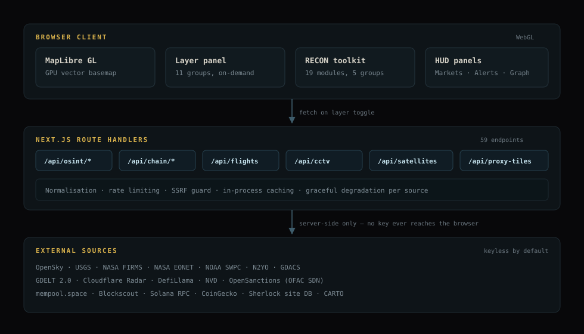

<div align="center">


# OSIRIS

### Open Source Intelligence & Reconnaissance Integrated System

**A real-time global intelligence workspace. Aircraft, vessels, satellites, seismic events, wildfires, CCTV networks, conflict zones, cyber threats and on-chain incidents — aggregated from public sources and rendered on one GPU-accelerated map.**

[](https://osirisai.live)
[](https://nextjs.org)
[](https://typescriptlang.org)
[](https://maplibre.org)
[](https://github.com/simplifaisoul/osiris/pkgs/container/osiris)
[](LICENSE)

[**Live instance**](https://osirisai.live) · [Report a bug](https://github.com/simplifaisoul/osiris/issues) · [Request a feature](https://github.com/simplifaisoul/osiris/issues) · [Discord](https://discord.gg/umBykEpb98)

</div>

---

## Try it

The fastest way to see OSIRIS is the hosted instance — no install, no keys:

### → **[osirisai.live](https://osirisai.live)**

Toggle a few layers from the left rail, then open **RECON** on the right and run a
lookup. Everything below runs the same on your own machine.

---

## What it is

OSIRIS pulls from ~40 public intelligence sources, normalises them behind a single
API surface, and draws the result as WebGL geometry rather than DOM nodes — so
thousands of live entities stay at interactive framerates.

Two things make it more than a map:

- **A 19-module reconnaissance toolkit** for investigating a specific target —
  an IP, a domain, a wallet, a handle, a phone number.
- **An honesty-first data model.** Where a source refuses a request, rate-limits,
  or returns something unverifiable, OSIRIS says so rather than rendering a
  confident blank. Absence of evidence is never displayed as evidence of absence.

Everything works **without a single API key**. Credentials only ever widen
coverage, and no key is exposed to the browser.

---

## Intelligence domains

| Domain | What you get | Primary sources |
|---|---|---|
| **Aviation** | Commercial, private, military traffic | OpenSky Network |
| **Maritime** | Vessels, 39 ports, 10 chokepoints | AISStream, Digitraffic |
| **Space** | Satellite tracks, solar weather | N2YO, NOAA SWPC |
| **Seismic** | Live M2.5+ events | USGS |
| **Wildfire** | Active hotspots | NASA FIRMS |
| **Severe weather** | Storms, floods, natural hazards | NASA EONET, GDACS |
| **Surveillance** | 2,000+ public cameras, live news feeds | TfL, WSDOT, Caltrans, NYC DOT, VicRoads |
| **Conflict** | 13 active zones, severity-coded | Curated OSINT |
| **Cyber** | Live attack traffic, malware nodes | Public threat feeds |
| **Net & event intel** | Geocoded world events, outages, attack origins | GDELT 2.0, Cloudflare Radar |
| **Blockchain** | Wallet forensics, exploits, sanctioned addresses | mempool.space, Blockscout, Solana RPC, DefiLlama, OFAC SDN |

---

## RECON toolkit

19 modules grouped by what you're investigating. The panel expands to a two-pane
workspace — tool rail on the left, results filling the width.

| Group | Modules |
|---|---|
| **Network & host** | Port scan · Vuln sweep · Shodan IoT · BGP route · MAC address · IP sweep |
| **Domain & web** | DNS · WHOIS · Certificates · SSL/TLS · Subdomains · Headers · Tech detect |
| **Identity** | Username hunt · GitHub recon · Phone intel |
| **Threat & exposure** | Threat reputation · Data leaks |
| **Blockchain** | Chain intel — daily brief + wallet forensics |

### Username hunt

Enumerates a handle across social platforms using the
[Sherlock Project](https://github.com/sherlock-project/sherlock)'s site database
(MIT, 481 sites), reimplemented in TypeScript.

The interesting part is what it *refuses* to claim. Many platforms return HTTP 200
for a profile that doesn't exist, so a naive scan reports accounts that were never
there. Every positive is re-tested against two random control handles; any site that
also "finds" those is reported as **unverifiable** rather than as a hit. Sites that
refuse the request (403/429, bot challenges) are reported as **blocked** — not as
"no account".

Measured against known-good handles: a control username that cannot exist went from
8 false hits to **0**, and results are stable across repeated scans.

### Chain intel

**Daily brief** — on-chain exploits with loss figures and attack technique
(DefiLlama), crypto CVEs date-ranged from NVD, and OFAC-designated wallets
classified by address shape. Auto-refreshes; one-click AI summary.

**Wallet forensics** — paste a BTC, ETH or SOL address for balance and USD value,
transaction history, counterparty breakdown, token holdings, ENS resolution, OFAC
screening, and a risk score where every factor states the observation that
triggered it.

Chain is detected from address format. Sanctions screening is real: OFAC lists
designated wallets as entity names, so a listed address returns **100 / critical**
with the SDN entry attached.

---

## Architecture

<div align="center">
  
</div>

Layers fetch on toggle rather than at load, so an idle session costs nothing.
Every external call is made server-side — API keys never reach the browser — and
each route normalises, rate-limits, caches, and degrades independently. One dead
upstream never blanks the map.

---

## Quick start

```bash
git clone https://github.com/simplifaisoul/osiris.git
cd osiris
npm install
npm run dev
```

Open **http://localhost:3000**.

### Docker

```bash
docker pull ghcr.io/simplifaisoul/osiris:latest
docker run -d -p 3000:3000 ghcr.io/simplifaisoul/osiris:latest
```

Or build from source with compose:

```bash
cp .env.example .env
docker compose up -d
```

Multi-stage `node:22-alpine` standalone build, ~220 MB, runs non-root. The compose
file carries CasaOS metadata (`x-casaos:`) for one-click install. Full guide in
**[DOCKER.md](DOCKER.md)**.

> **Self-hosting tip:** persist `/app/.next/cache` on a volume so image updates
> aren't disruptive — and `chown` it to uid `1001`, or Next silently fails to write
> the cache and every page load becomes a cold load. See
> [#250](https://github.com/simplifaisoul/osiris/issues/250).

The container always listens on `3000`; set `OSIRIS_PORT` in `.env` to change the
published host port without editing compose.

---

## Configuration

**OSIRIS runs fully keyless.** Every variable below is optional and only widens
coverage. Copy [`.env.example`](.env.example) to `.env` and set what you want.

| Variable | Unlocks | Get one |
|---|---|---|
| `SCANNER_URL` / `SCANNER_KEY` | Active scanning modules in RECON | self-hosted backend |
| `CLOUDFLARE_API_TOKEN` | Internet outages + attack-origin layers | Cloudflare → API Tokens → *Radar: Read* |
| `FIRMS_API_KEY` | Higher NASA FIRMS rate limits | [firms.modaps.eosdis.nasa.gov](https://firms.modaps.eosdis.nasa.gov/api/map_key/) |
| `OPENSKY_CLIENT_ID` / `_SECRET` | Full global flight coverage | [opensky-network.org](https://opensky-network.org) |
| `N2YO_API_KEY` | Extended satellite catalogue | [n2yo.com](https://n2yo.com) |
| `AIS_API_KEY` | Worldwide vessel streaming | [aisstream.io](https://aisstream.io) |
| `ETHERSCAN_API_KEY` | Richer Ethereum history | [etherscan.io/apis](https://etherscan.io/apis) |
| `HELIUS_API_KEY` | Solana transfer amounts + counterparties | [helius.dev](https://helius.dev) |
| `GEMINI_API_KEY_1…8` | AI overview prose (heuristic fallback otherwise) | Google AI Studio |

Anything credential-gated **fails closed**: the route returns 503 and the
corresponding toggle stays hidden, rather than presenting an empty layer as though
it were a quiet day.

`.env` is gitignored — only the example is committed.

---

## Tech stack

| Layer | Technology |
|---|---|
| Framework | Next.js 16 — App Router, Turbopack |
| Language | TypeScript 5 |
| Map engine | MapLibre GL JS (WebGL) |
| Basemap | CARTO vector tiles, proxied + cached |
| Motion | Framer Motion |
| Icons | Lucide |
| AI | Google Gemini, optional — heuristic fallback always available |
| Deploy | Vercel, Docker, CasaOS |

---

## Keyboard shortcuts

| Key | Action |
|---|---|
| `F` | Toggle flight layers |
| `E` | Toggle earthquakes |
| `S` | Toggle satellites |
| `D` | Toggle day/night terminator |
| `Esc` | Close panel / exit expanded view |
| `?` | Shortcut reference |

---

## Design principles

**Never fabricate confidence.** A refused request, a rate limit and an absent
record are three different things and are displayed as three different things.

**Fail closed, not blank.** Missing credentials hide a feature; they never render
an empty result that reads as "nothing found".

**Cite the observation.** Risk scores and threat ratings show the evidence that
produced them, not just a number.

**Keyless by default.** The full experience should be reachable by someone who
just cloned the repo.

---

## Contributing

Issues and pull requests are welcome. If you're reporting a bug, the diagnostics in
[#250](https://github.com/simplifaisoul/osiris/issues/250) are a good model —
reproduction steps, ruled-out causes, and observed logs.

Security disclosures: see **[SECURITY.md](SECURITY.md)**.

---

## Credits

Built on the work of many public data providers and open-source projects, notably
[MapLibre](https://maplibre.org), [OpenSky Network](https://opensky-network.org),
[USGS](https://earthquake.usgs.gov), [NASA FIRMS & EONET](https://firms.modaps.eosdis.nasa.gov),
[GDELT](https://www.gdeltproject.org), [OpenSanctions](https://www.opensanctions.org),
[DefiLlama](https://defillama.com), [Blockscout](https://blockscout.com),
[mempool.space](https://mempool.space) and the
[Sherlock Project](https://github.com/sherlock-project/sherlock).

Licensed **MIT** — see [LICENSE](LICENSE).

---

<div align="center">

### Support OSIRIS

OSIRIS is entirely open source, but the backend scanners and data firehoses aren't free.

🔗 **[Support the project on Patreon](https://www.patreon.com/posts/159077425)**

*Supporters receive the `🔴 RedTeam Console` role and access to developer comms.*

Built by **[simplifaisoul](https://github.com/simplifaisoul)** · [Join the Discord](https://discord.gg/umBykEpb98)

</div>
