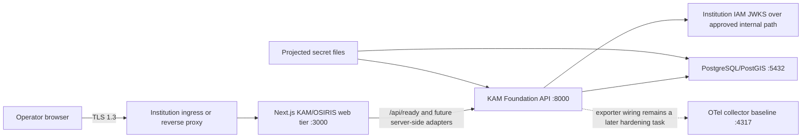

# KAM / SPYS Foundation Deployment Guide

Version: Phase 1 / schema revision `0001_foundation`  
Repository: `/Users/badtux/osiris`  
Last verified: 2026-07-18

## 1. What is implemented

The KAM Phase 1 foundation is implemented in the OSIRIS website repository, but it is deployed as two cooperating runtime services:



The repository currently contains:

- The existing Next.js 16 / React 19 OSIRIS website.
- A Next.js readiness bridge at `/api/ready`.
- A separate FastAPI foundation service under `services/api`.
- PostgreSQL/Alembic models for common objects, SPYS planning projects, temporary allocations, and audit events.
- Institution OIDC/JWT verification, signed MFA assurance, device claim validation, RBAC, tenant isolation, and classification policy.
- Hash-chained audit events, Decimal currency conversion, DEMAT 92/31-day rules, and four-eyes project approval.
- Docker Compose and Kubernetes deployment baselines.

The following are deliberately not represented as complete:

- No SPYS browser screens were created because ADR-001 still requires the institution to resolve the Angular-versus-Next.js requirement.
- The existing public OSIRIS API routes have not all been migrated to the new OIDC, policy, Zod, and audit path.
- The website currently calls the foundation service only through `/api/ready`; later approved SPYS UI work must consume the protected `/v1/*` APIs.
- Production IAM, PKI, PostgreSQL HA, SIEM, backup, and registry services must be supplied by the institution.

## 2. Deployment profiles

### 2.1 `SPYS_AIRGAP` — KAM/SPYS production baseline

Use the root Compose file together with `infra/docker/docker-compose.foundation.yml`. Both application networks are internal. Public OSIRIS feeds and external map tiles are unavailable even if a legacy route is invoked.

Institution IAM must be reachable through a separately approved internal Docker/Kubernetes network. Do not add general internet access to make JWKS validation work.

### 2.2 `OSIRIS_CONNECTED` — existing connected OSINT website

Use the root `docker-compose.yml` without the air-gap foundation overlay. This preserves the existing public OSINT feeds. It does not deploy the KAM foundation database/API by itself.

A connected deployment that also requires the foundation service needs an institution-specific egress policy allowing IAM and approved infrastructure only. The supplied air-gap overlay must not be weakened into unrestricted egress.

## 3. Required institutional decisions and dependencies

Do not begin a production cutover until all items have an owner and evidence:

1. ADR-001 decision: retain Next.js/React for SPYS UI or provide a separate Angular UI.
2. Institution IAM issuer, JWKS URL, audience, MFA claims, device claim, session timeout, and login lockout policy.
3. Internal DNS and network path from the foundation API to IAM.
4. PostgreSQL 16/PostGIS 3.5 service, backup policy, point-in-time recovery, and an application database owner.
5. Container registry path and immutable image tag or digest.
6. TLS 1.3 ingress and, where required, service-to-service mTLS.
7. Secret projection through OpenBao, Vault, External Secrets, CSI, Docker secrets, or the institution equivalent.
8. UTC/NTP synchronization with display timezone `Europe/Istanbul`.
9. Monitoring, alert routing, SIEM destination, retention, and audit export ownership.
10. Approved rollback window and database restore authority.

## 4. Identity contract

The foundation API stores no local passwords or MFA secrets. Access tokens must be signed by Institution IAM and contain:

| Claim | Requirement |
|---|---|
| `sub` | Stable user identifier |
| `iss` | Exact `OIDC_ISSUER` |
| `aud` | Contains exact `OIDC_AUDIENCE` |
| `iat`, `exp` | Required; signature and expiry are validated |
| `tenant_id` | Required for tenant isolation |
| `roles` or `realm_access.roles` | Application roles |
| `classifications` | One or more clearance labels |
| `device_id` | Required by default; claim name is configurable with `OIDC_DEVICE_CLAIM` |
| `amr` | Must contain `mfa` by default, or `acr` must match an allowed configured value |

Supported roles are:

| Role | Purpose |
|---|---|
| `kam.ingest` | Create common objects |
| `kam.analyst` | Create common objects and perform analyst work |
| `kam.auditor` | Verify the audit hash chain |
| `spys.viewer` | Read/use foundation calculation rules |
| `spys.editor` | Create projects and submit workflow transitions |
| `spys.approver` | Approve/reject projects, subject to four-eyes checks |
| `kam.admin` | Administrative override; use sparingly and audit assignments |

Classification values are `UNCLASSIFIED`, `RESTRICTED`, `CONFIDENTIAL`, `SECRET`, and `TOP_SECRET`.

## 5. Network and port matrix

| Source | Destination | Port | Required |
|---|---|---:|---|
| Institution ingress | Next.js web tier | 3000/TCP internally | Yes |
| Next.js web tier | Foundation API | 8000/TCP | Yes |
| Foundation API/migration job | PostgreSQL | 5432/TCP | Yes |
| Foundation API | Institution IAM | 443/TCP | Yes when auth is enabled |
| Foundation API | OTel collector | 4317/TCP | Optional until exporter wiring is enabled |
| Prometheus | Foundation `/metrics` | 8000/TCP internally | Optional |
| Public internet | Any SPYS service | Any | Denied |

Expose only the institution ingress. `/health`, `/ready`, `/metrics`, PostgreSQL, and the foundation API should remain internal unless an authenticated API gateway explicitly publishes protected `/v1/*` routes.

## 6. Source and build preflight

Run from the repository root:

```bash
cd /Users/badtux/osiris
npm ci
npm run typecheck
npm test
npm run build

python3.12 -m venv services/api/.venv
services/api/.venv/bin/pip install -e 'services/api[test]'
services/api/.venv/bin/pip check
services/api/.venv/bin/pytest -q services/api/tests

kubectl kustomize infra/kubernetes/base >/dev/null
git diff --check
```

Expected application test totals for this revision are 10 web tests passed, 1 explicitly skipped live-network test, and 20 Python tests passed.

The focused foundation lint gate is:

```bash
./node_modules/.bin/eslint \
  src/proxy.ts \
  src/app/api/ready/route.ts \
  src/lib/foundation/*.ts \
  packages/contracts/src/*.ts
```

Full-repository lint currently contains inherited legacy findings. Do not disable rules or treat the focused gate as proof that all legacy routes are compliant.

## 7. Docker Compose deployment — SPYS air-gap profile

### 7.1 Prepare the environment file

```bash
cd /Users/badtux/osiris
cp .env.example .env
```

Edit `.env` and set at minimum:

```dotenv
DEPLOYMENT_PROFILE=SPYS_AIRGAP
ENVIRONMENT=production
AUTH_REQUIRED=true

OIDC_ISSUER=https://institution-iam.internal/realms/kam
OIDC_JWKS_URL=https://institution-iam.internal/realms/kam/protocol/openid-connect/certs
OIDC_AUDIENCE=kam-multi-int
OIDC_MFA_REQUIRED=true
OIDC_MFA_AMR_VALUE=mfa
OIDC_MFA_ACR_VALUES=
OIDC_DEVICE_CLAIM=device_id

REQUIRED_SCHEMA_REVISION=0001_foundation
PUBLIC_CONNECTORS_ENABLED=false
TELEMETRY_ENABLED=false

POSTGRES_PASSWORD_SOURCE_FILE=./secrets/postgres_password
AUDIT_HMAC_KEY_SOURCE_FILE=./secrets/audit_hmac_key
INSTITUTION_IAM_DOCKER_NETWORK=institution-iam
```

Keep the in-container paths unchanged:

```dotenv
DATABASE_PASSWORD_FILE=/run/secrets/postgres_password
AUDIT_HMAC_KEY_FILE=/run/secrets/audit_hmac_key
```

Do not put the PostgreSQL password, audit HMAC key, access tokens, or client secrets directly in `.env`.

### 7.2 Generate local Docker secret files

For a controlled standalone host, create secrets with restrictive permissions:

```bash
cd /Users/badtux/osiris
install -d -m 0700 secrets
umask 077
openssl rand -base64 48 > secrets/postgres_password
openssl rand -base64 48 > secrets/audit_hmac_key
chmod 0600 secrets/postgres_password secrets/audit_hmac_key
```

In managed environments, project these files from the approved secret manager instead. Back up the audit key through the institution key-recovery process: losing it prevents historical audit verification; changing it without a controlled chain transition invalidates verification.

### 7.3 Attach the approved IAM network

The optional `docker-compose.institution-network.yml` file attaches only the foundation API to an existing institution-controlled network.

Verify the network exists:

```bash
docker network inspect institution-iam >/dev/null
```

If IAM runs as another container stack, its authorized endpoint must also be attached to this network. If IAM is remote, provide an approved internal gateway/proxy instead of granting general egress.

### 7.4 Validate the resolved Compose model

Use all three files for the SPYS deployment:

```bash
docker compose \
  -f docker-compose.yml \
  -f infra/docker/docker-compose.foundation.yml \
  -f infra/docker/docker-compose.institution-network.yml \
  config --quiet
```

Inspect the non-secret result before applying it:

```bash
docker compose \
  -f docker-compose.yml \
  -f infra/docker/docker-compose.foundation.yml \
  -f infra/docker/docker-compose.institution-network.yml \
  config --services
```

Expected foundation services are `foundation-api`, `postgres`, and `otel-collector`, in addition to the existing OSIRIS services.

### 7.5 Build immutable images

```bash
docker compose \
  -f docker-compose.yml \
  -f infra/docker/docker-compose.foundation.yml \
  -f infra/docker/docker-compose.institution-network.yml \
  build osiris foundation-api
```

For production, tag and push images to the institution registry, scan them, generate an SBOM, and record the resulting digest. Do not deploy a mutable `latest` tag.

### 7.6 Start PostgreSQL and create a backup point

```bash
docker compose \
  -f docker-compose.yml \
  -f infra/docker/docker-compose.foundation.yml \
  -f infra/docker/docker-compose.institution-network.yml \
  up -d postgres otel-collector
```

Wait until PostgreSQL is healthy:

```bash
docker compose \
  -f docker-compose.yml \
  -f infra/docker/docker-compose.foundation.yml \
  -f infra/docker/docker-compose.institution-network.yml \
  ps postgres
```

For an upgrade of a non-empty environment, take and verify an institution-approved backup before migration. A Compose-host example is:

```bash
install -d -m 0700 backups
docker compose \
  -f docker-compose.yml \
  -f infra/docker/docker-compose.foundation.yml \
  -f infra/docker/docker-compose.institution-network.yml \
  exec -T postgres pg_dump -U kam_app -d kam -Fc > backups/kam-pre-0001.dump
test -s backups/kam-pre-0001.dump
```

Move the backup into approved protected storage; do not commit it.

### 7.7 Run the database migration

The foundation image includes `alembic.ini` and the migration files. Run migration before admitting traffic:

```bash
docker compose \
  -f docker-compose.yml \
  -f infra/docker/docker-compose.foundation.yml \
  -f infra/docker/docker-compose.institution-network.yml \
  run --rm --no-deps foundation-api alembic upgrade head
```

Verify the current revision:

```bash
docker compose \
  -f docker-compose.yml \
  -f infra/docker/docker-compose.foundation.yml \
  -f infra/docker/docker-compose.institution-network.yml \
  run --rm --no-deps foundation-api alembic current
```

The expected revision is `0001_foundation`. The `/ready` endpoint also refuses readiness when the database revision differs from `REQUIRED_SCHEMA_REVISION`.

Do not run `scripts/seed_synthetic.py` in production. It is training/test data only and is not an idempotent production bootstrap.

### 7.8 Start the foundation and website

```bash
docker compose \
  -f docker-compose.yml \
  -f infra/docker/docker-compose.foundation.yml \
  -f infra/docker/docker-compose.institution-network.yml \
  up -d foundation-api osiris
```

Start the optional existing cache/intelligence services only if they are approved for the selected deployment:

```bash
docker compose \
  -f docker-compose.yml \
  -f infra/docker/docker-compose.foundation.yml \
  -f infra/docker/docker-compose.institution-network.yml \
  up -d osiris-cache osiris-intel
```

The cache's public tile proxy cannot reach CARTO in the air-gap profile. An approved offline tile service is required for a fully functional SPYS base map.

### 7.9 Verify health and readiness

Liveness from inside the foundation container:

```bash
docker compose \
  -f docker-compose.yml \
  -f infra/docker/docker-compose.foundation.yml \
  -f infra/docker/docker-compose.institution-network.yml \
  exec -T foundation-api \
  python -c "import urllib.request; print(urllib.request.urlopen('http://127.0.0.1:8000/health').read().decode())"
```

Foundation readiness must report `ready` for the database revision, security configuration, audit key, and Institution IAM:

```bash
docker compose \
  -f docker-compose.yml \
  -f infra/docker/docker-compose.foundation.yml \
  -f infra/docker/docker-compose.institution-network.yml \
  exec -T foundation-api \
  python -c "import urllib.request; print(urllib.request.urlopen('http://127.0.0.1:8000/ready').read().decode())"
```

Verify the bridge through the website, replacing the port if `OSIRIS_PORT` differs:

```bash
curl --fail --show-error http://127.0.0.1:3000/api/ready
```

Inspect service state and recent logs without printing environment values:

```bash
docker compose \
  -f docker-compose.yml \
  -f infra/docker/docker-compose.foundation.yml \
  -f infra/docker/docker-compose.institution-network.yml \
  ps

docker compose \
  -f docker-compose.yml \
  -f infra/docker/docker-compose.foundation.yml \
  -f infra/docker/docker-compose.institution-network.yml \
  logs --tail=200 foundation-api postgres osiris
```

### 7.10 TLS publication

The supplied containers listen on internal HTTP. Place them behind the institution ingress/reverse proxy and require:

- TLS 1.3 for client-facing traffic.
- An institution-issued certificate with automated expiry monitoring.
- HSTS after hostname validation.
- mTLS or an equivalent authenticated service identity between ingress/web/API where mandated.
- Request size and rate limits.
- No public route to PostgreSQL, `/metrics`, or raw foundation health endpoints.
- Authorization headers preserved only on approved protected API paths.

Do not use the development Nginx cache as the production TLS boundary without a separate security review and hardened configuration.

## 8. Kubernetes deployment

The supplied Kubernetes base deploys the foundation API, its Service, ServiceAccount, HPA, PDB, and default-deny NetworkPolicies. It intentionally does not create PostgreSQL, the OSIRIS web Deployment, ingress, certificates, IAM, or production secrets.

Operators who are new to Kubernetes should follow `docs/deployment/KAM-KUBERNETES-BEGINNER-GUIDE.md` first; it explains each term, command, expected result, and stop condition.

### 8.1 Cluster prerequisites

- Kubernetes supports `networking.k8s.io/v1`, `autoscaling/v2`, and `policy/v1`.
- A CNI plugin enforces NetworkPolicy.
- Metrics Server provides the resource metrics API for HPA.
- The `institution-iam` namespace exists and is the only IAM egress target.
- PostgreSQL is reachable as `postgres:5432` in namespace `kam`, with pod label `app=postgres`; otherwise create an approved overlay for the actual database endpoint and NetworkPolicy.
- The web pod that calls the API has label `app=osiris-web` in namespace `kam`.
- The registry is reachable from cluster nodes and image-pull credentials are configured.

### 8.2 Build and push the foundation image

```bash
cd /Users/badtux/osiris
docker build -f services/api/Dockerfile -t REGISTRY/kam/foundation-api:0.1.0 services/api
docker push REGISTRY/kam/foundation-api:0.1.0
docker image inspect REGISTRY/kam/foundation-api:0.1.0 --format '{{index .RepoDigests 0}}'
```

Replace `REGISTRY` with the approved registry. Record and preferably deploy the digest.

### 8.3 Create a Kustomize production overlay

Never edit credentials into the base. Create `infra/kubernetes/overlays/production/kustomization.yaml`:

```yaml
apiVersion: kustomize.config.k8s.io/v1beta1
kind: Kustomization
resources:
  - ../../base
images:
  - name: registry.invalid/kam/foundation-api
    newName: REGISTRY/kam/foundation-api
    newTag: 0.1.0
```

Use additional patches for the real database DNS name, IAM claim mapping, resource limits, image pull secret, and institution annotations. Keep `PUBLIC_CONNECTORS_ENABLED=false` for SPYS.

Render and review before applying:

```bash
kubectl kustomize infra/kubernetes/overlays/production > /tmp/kam-production.yaml
kubectl apply --dry-run=server -f /tmp/kam-production.yaml
```

### 8.4 Create namespace and secrets

Create the restricted namespace first:

```bash
kubectl apply -f infra/kubernetes/base/namespace.yaml
```

Production should use the institution's External Secrets/CSI workflow to create `kam-foundation-secrets`. It must expose these exact keys:

| Secret key | Mounted/used as |
|---|---|
| `postgres-password` | `/run/secrets/postgres_password` |
| `audit-hmac-key` | `/run/secrets/audit_hmac_key` |
| `oidc-issuer` | `OIDC_ISSUER` |
| `oidc-jwks-url` | `OIDC_JWKS_URL` |

For a non-production lab only, file-based creation avoids putting values directly in shell history:

```bash
kubectl -n kam create secret generic kam-foundation-secrets \
  --from-file=postgres-password=secrets/postgres_password \
  --from-file=audit-hmac-key=secrets/audit_hmac_key \
  --from-file=oidc-issuer=secrets/oidc_issuer \
  --from-file=oidc-jwks-url=secrets/oidc_jwks_url \
  --dry-run=client -o yaml | kubectl apply -f -
```

Do not commit the generated Secret manifest or its source files.

### 8.5 Apply the base and verify policy objects

```bash
kubectl apply -k infra/kubernetes/overlays/production
kubectl -n kam get deployment,service,pdb,hpa,networkpolicy
```

Before migration the API pods may be running but must remain NotReady because the schema revision is absent or old.

### 8.6 Run migration as a one-shot Job

The migration Job is separate from the base so schema changes remain an explicit, auditable deployment step. Replace its image locally and apply it:

```bash
kubectl set image \
  -f infra/kubernetes/jobs/foundation-migrate-0001.yaml \
  migrate=REGISTRY/kam/foundation-api:0.1.0 \
  --local -o yaml | kubectl apply -f -

kubectl -n kam wait \
  --for=condition=complete \
  job/foundation-migrate-0001 \
  --timeout=300s

kubectl -n kam logs job/foundation-migrate-0001
```

If it fails:

```bash
kubectl -n kam describe job foundation-migrate-0001
kubectl -n kam logs job/foundation-migrate-0001 --all-containers
```

Do not repeatedly delete and recreate a failed migration Job without identifying the database state. Use a new revision-specific Job name for future migrations.

### 8.7 Verify rollout and readiness

```bash
kubectl -n kam rollout status deployment/foundation-api --timeout=300s
kubectl -n kam get pods -l app=foundation-api
kubectl -n kam get hpa foundation-api
```

Port-forward only for an operator verification session:

```bash
kubectl -n kam port-forward service/foundation-api 18000:8000
```

In a second terminal:

```bash
curl --fail --show-error http://127.0.0.1:18000/health
curl --fail --show-error http://127.0.0.1:18000/ready
curl --fail --show-error http://127.0.0.1:18000/metrics | head
```

Stop port-forwarding after verification. Do not expose this Service with `LoadBalancer` or `NodePort` in SPYS.

### 8.8 Ingress and web-tier integration

Deploy the existing Next.js application separately with:

```text
FOUNDATION_API_URL=http://foundation-api.kam.svc.cluster.local:8000
DEPLOYMENT_PROFILE=SPYS_AIRGAP
TELEMETRY_ENABLED=false
```

Label its pod `app=osiris-web`; otherwise the default-deny policy blocks the web-to-foundation connection.

The institution ingress should route the website to the Next.js Service. Publish foundation `/v1/*` only if an approved authenticated client needs direct access. Keep `/health`, `/ready`, and `/metrics` on internal monitoring paths.

## 9. API smoke verification

### 9.1 Unauthenticated denial

Against an internal/operator-only foundation endpoint:

```bash
curl -i http://127.0.0.1:18000/v1/audit/verify
```

Expected result: `401` with a structured `AUTHENTICATION_REQUIRED` error and a correlation ID.

### 9.2 Authenticated audit verification

Acquire an access token through the approved Institution IAM flow. Do not paste production tokens into tickets, command history, or documents.

```bash
read -s KAM_ACCESS_TOKEN
export KAM_ACCESS_TOKEN
curl --fail --show-error \
  -H "Authorization: Bearer ${KAM_ACCESS_TOKEN}" \
  http://127.0.0.1:18000/v1/audit/verify
unset KAM_ACCESS_TOKEN
```

The token must contain `kam.auditor` or `kam.admin`, an accepted MFA assurance, tenant, classification, and device claims. A new database should return a valid chain with zero events.

### 9.3 DEMAT boundary verification

Use dates calculated by the acceptance test owner. The endpoint requires `spys.viewer`, `spys.editor`, or `kam.admin`:

```bash
read -s KAM_ACCESS_TOKEN
export KAM_ACCESS_TOKEN
curl --fail --show-error \
  -H "Authorization: Bearer ${KAM_ACCESS_TOKEN}" \
  "http://127.0.0.1:18000/v1/foundation/allocations/expiry?due_at=2026-10-18&as_of=2026-07-18"
unset KAM_ACCESS_TOKEN
```

Automated tests are the authoritative boundary evidence; do not infer month lengths from this example.

## 10. Observability and audit operations

- `/metrics` exposes Prometheus request counts and latency histograms.
- `/health` proves process liveness only.
- `/ready` checks database access and schema revision, security configuration, audit key readability, and IAM JWKS availability.
- Every response carries `X-Correlation-Id` and `Cache-Control: no-store`.
- Audit chain verification is available at `/v1/audit/verify` to `kam.auditor` and `kam.admin`.
- A failed audit verification is a security incident: stop mutations, preserve database/storage snapshots, and notify the SOC/SIEM owner.

The supplied OTel collector is configured to accept OTLP and expose collector metrics, but the foundation service does not yet initialize an OTel SDK exporter. Use the API's `/metrics` endpoint as the current application metric source. Wire the SDK, remove the debug exporter, and connect the approved institution backend before claiming distributed tracing coverage.

## 11. Backup, upgrade, and rollback

### 11.1 Before every upgrade

1. Record deployed web/API image digests.
2. Record `alembic current`.
3. Verify a recent restorable PostgreSQL backup.
4. Export/verify the audit chain.
5. Confirm IAM/JWKS availability.
6. Run all preflight gates.
7. Obtain the change window and rollback authority.

### 11.2 Application rollback

If the schema remains backward compatible, roll the web and API images back to the previously recorded digest, then verify `/ready`, authentication, authorization, and audit verification.

Docker Compose:

```bash
docker compose \
  -f docker-compose.yml \
  -f infra/docker/docker-compose.foundation.yml \
  -f infra/docker/docker-compose.institution-network.yml \
  up -d --no-deps foundation-api osiris
```

Kubernetes:

```bash
kubectl -n kam rollout undo deployment/foundation-api
kubectl -n kam rollout status deployment/foundation-api --timeout=300s
```

`rollout undo` is acceptable only when the stored ReplicaSet references the approved prior digest.

### 11.3 Database rollback

The Phase 1 downgrade removes the Phase 1 tables and their data. Never run it as an automatic response to an application error.

Use `alembic downgrade base` only after:

- traffic is stopped;
- audit evidence and a database snapshot are preserved;
- the data owner approves data loss or a tested restore plan;
- the previous application image is ready;
- the change is recorded.

Restoring the verified pre-migration backup is generally safer than destructive downgrade for a populated environment.

## 12. Troubleshooting

### `/api/ready` returns `FOUNDATION_NOT_CONFIGURED`

`FOUNDATION_API_URL` is absent from the Next.js runtime. Set it to the internal foundation service URL and restart/redeploy the web tier.

### `/api/ready` returns `FOUNDATION_UNAVAILABLE`

Check Next-to-foundation DNS/network policy, then call the foundation `/ready` endpoint internally. The Next bridge deliberately hides dependency details.

### Foundation `/ready` reports database unavailable

Check, in order:

1. `postgres_password` secret is mounted and non-empty.
2. `DATABASE_URL` host, port, user, and database.
3. NetworkPolicy/firewall rules.
4. PostgreSQL health and authentication logs.
5. `alembic current` equals `REQUIRED_SCHEMA_REVISION`.

### Foundation `/ready` reports IAM unavailable

Check internal DNS, TLS trust, issuer/JWKS URL, network policy, and whether the JWKS endpoint answers within three seconds. Do not bypass verification or disable auth in production.

### Token returns `401 INVALID_TOKEN`

Verify signature algorithm, issuer, audience, expiry/clock synchronization, `tenant_id`, and the configured device claim. Token contents must come from the signed JWT, not caller-supplied headers.

### Token returns `403 MFA_REQUIRED`

Ensure IAM emits the configured `amr` value or one of `OIDC_MFA_ACR_VALUES`. Do not set `OIDC_MFA_REQUIRED=false` in production to work around an IAM mapping problem.

### Token returns `403 FORBIDDEN`

Check application role, tenant, and classification claims. Avoid granting `kam.admin` as a shortcut.

### Migration Job cannot reach PostgreSQL

The Job must retain label `app=foundation-migration`, and the PostgreSQL pod must have label `app=postgres` in namespace `kam`. If using managed PostgreSQL, add a narrowly scoped production-overlay egress rule.

### Air-gap map is blank

The existing OSIRIS base map depends on external tiles. The air-gap network correctly blocks them. Configure an approved offline tile service in a later institution-approved deployment overlay; do not open general internet egress.

### Docker image build cannot start

Verify the Docker daemon is running and that the host architecture has supported base images. The earlier local verification environment could validate Compose but did not have a responsive Docker daemon, so image-build evidence must be produced in CI or on the deployment host.

### `kubectl` reports `illegal base64 data` while loading kubeconfig

The active kubeconfig contains malformed certificate or token data. Select a known-good institution kubeconfig or repair the affected credential entry, then rerun both client rendering and server-side dry-run. Do not bypass the server validation gate for a production deployment.

## 13. Final go-live checklist

- [ ] ADR-001 decision recorded.
- [ ] Source commit and image digests recorded.
- [ ] Web build, tests, foundation tests, focused lint, and manifest validation pass.
- [ ] Root lockfile hash matches the approved value.
- [ ] Secrets originate from the approved secret manager and are not in Git or `.env`.
- [ ] IAM claims, MFA, device identity, session timeout, and lockout tested.
- [ ] PostgreSQL backup and restore test evidence exists.
- [ ] Migration completed at `0001_foundation`.
- [ ] `/health` and `/ready` pass.
- [ ] Unauthenticated access returns structured `401`.
- [ ] RBAC, tenant, classification, and four-eyes negative tests pass.
- [ ] Audit verification passes and SIEM ownership is assigned.
- [ ] TLS 1.3 and required mTLS verified.
- [ ] SPYS has no general internet egress.
- [ ] HPA/PDB and failure behavior verified.
- [ ] Rollback rehearsal completed.
- [ ] No production or operationally sensitive data is used as demo content.

## 14. Related documents

- `docs/requirements/unified-feature-inventory.md`
- `docs/requirements/codebase-gap-analysis.md`
- `docs/requirements/phased-implementation-roadmap.md`
- `docs/requirements/requirements-traceability-matrix.md`
- `docs/requirements/phase-1-verification.md`
- `docs/adr/ADR-001-frontend-framework.md`
- `docs/adr/ADR-002-institution-iam.md`
- `docs/adr/ADR-003-network-separation.md`
- `docs/security/threat-model.md`
- `docs/operations/foundation-runbook.md`
