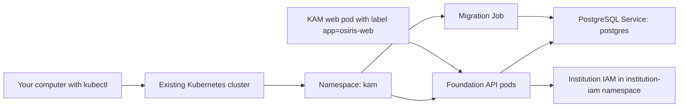

# KAM Kubernetes Deployment — Beginner Guide

Audience: junior developers, application support staff, and operators who are new to Kubernetes  
Application: KAM Phase 1 Foundation API  
Expected database revision: `0001_foundation`  
Namespace: `kam`

## Read this first

This guide helps you deploy the KAM Foundation API into an **existing Kubernetes cluster**.

It does not create these production systems:

- The Kubernetes cluster itself.
- PostgreSQL/PostGIS.
- Institution IAM/OIDC.
- The private container registry.
- TLS certificates or the public website address.
- The existing Next.js KAM/OSIRIS website Deployment.

Your platform or infrastructure team must provide those systems. If any required item is missing, stop at the relevant check instead of guessing a value.

> **Production safety rule:** Never paste passwords, access tokens, audit keys, or Kubernetes Secret YAML into Git, email, tickets, or chat.

> **Destructive action rule:** This guide does not ask you to delete the `kam` namespace or downgrade the database. Do not run those actions without the database owner and change manager.

## What you will deploy

You will deploy these items:

| Kubernetes item | Simple meaning |
|---|---|
| Namespace `kam` | A separate area in the cluster for KAM resources |
| ConfigMap | Non-secret application settings |
| Secret reference | Password, audit key, and IAM URLs supplied securely |
| Deployment | Keeps two Foundation API containers running |
| Service | Gives the API a stable internal address |
| Migration Job | Creates or upgrades the database tables once |
| NetworkPolicy | Blocks traffic except explicitly allowed paths |
| HPA | Adds/removes API replicas according to CPU use |
| PDB | Keeps at least one API replica available during maintenance |

The API is internal. You will temporarily use `port-forward` from your own computer to test it.

## Very small Kubernetes glossary

- **Cluster:** the group of servers running Kubernetes.
- **kubectl:** the command-line program used to talk to the cluster.
- **Context:** the cluster, user, and access configuration currently selected by `kubectl`.
- **Namespace:** a named area that groups resources.
- **Pod:** one running copy of an application container.
- **Deployment:** keeps the requested number of pods running.
- **Service:** a stable internal network name for pods.
- **Secret:** sensitive configuration stored by Kubernetes or an external secret manager.
- **ConfigMap:** non-sensitive configuration.
- **Job:** a task that runs to completion, such as a database migration.
- **Migration:** a controlled database schema change.
- **Ready:** the pod passed dependency checks and may receive traffic.
- **Running but NotReady:** the process started, but a dependency or configuration check failed.

## The deployment in one picture



## Part 1 — Collect everything before starting

Ask the platform team for the following information. Do not continue until every required row is complete.

| Item | Example format | Required? |
|---|---|---|
| Kubernetes context name | `institution-production` | Yes |
| Foundation API image | `registry.institution.local/kam/foundation-api:0.1.0` | Yes |
| Registry login method | node credential, pull secret, or public internal registry | Yes |
| PostgreSQL Service | `postgres` in namespace `kam` | Yes for the supplied base |
| Database name | `kam` | Yes |
| Database user | `kam_app` | Yes |
| Database password | supplied through approved secret process | Yes |
| OIDC issuer URL | `https://iam.internal/realms/kam` | Yes |
| OIDC JWKS URL | `https://iam.internal/realms/kam/.../certs` | Yes |
| OIDC audience | `kam-multi-int` | Yes |
| Accepted MFA claim | `amr=mfa` or approved `acr` | Yes |
| Device claim name | `device_id` | Yes |
| Audit HMAC key | at least 32 random bytes | Yes |
| Change ticket/reference | institution-specific | Production only |
| Database backup evidence | institution-specific | Existing production DB only |

The supplied NetworkPolicy expects:

- PostgreSQL in namespace `kam`, with pod label `app=postgres` and Service name `postgres`.
- Institution IAM in namespace `institution-iam`.
- The KAM web pod in namespace `kam`, with label `app=osiris-web`.

If your environment is different, the platform team must create an approved Kubernetes overlay. A junior operator should not weaken the NetworkPolicy.

## Part 2 — Open a terminal in the repository

Run:

```bash
cd /Users/badtux/osiris
pwd
```

Expected output:

```text
/Users/badtux/osiris
```

Check that the Kubernetes files exist:

```bash
ls infra/kubernetes/base
ls infra/kubernetes/jobs
ls infra/kubernetes/overlays/production
```

You should see files including:

```text
api-deployment.yaml
configmap.yaml
kustomization.yaml
network-policies.yaml
foundation-migrate-0001.yaml
```

Stop if files are missing.

## Part 3 — Check your tools

### 3.1 Check kubectl

```bash
kubectl version --client
```

You should see a client version. If the command is not found, ask the platform team to install `kubectl`.

### 3.2 Check Docker only if you must build the image

```bash
docker version
```

If the platform team already supplied an image, Docker is not required for the deployment steps on your computer.

### 3.3 Check the local manifest renderer

```bash
kubectl kustomize infra/kubernetes/overlays/production >/dev/null
```

No output and exit code `0` means the YAML structure can be rendered.

## Part 4 — Confirm the correct cluster

This is the most important safety check.

```bash
kubectl config current-context
kubectl config view --minify
```

Compare the context, cluster server, and user with the information from the platform team.

> **Stop immediately** if the context is unexpected, blank, a personal test cluster, or a different production environment.

Check that the cluster answers:

```bash
kubectl cluster-info
```

If you see an error such as `illegal base64 data`, your kubeconfig is damaged. Ask the platform team for a valid kubeconfig. Do not bypass this check.

Check your permissions:

```bash
kubectl auth can-i get pods --all-namespaces
kubectl auth can-i create namespaces
kubectl auth can-i create deployments --namespace kam
kubectl auth can-i create secrets --namespace kam
kubectl auth can-i create jobs --namespace kam
kubectl auth can-i create networkpolicies --namespace kam
```

Each required command should print `yes`. A production environment may intentionally prevent you from creating namespaces or secrets; in that case, ask the authorized platform operator to perform those specific steps.

## Part 5 — Confirm or obtain the container image

The Kubernetes base intentionally uses the invalid image name `registry.invalid`. This prevents an accidental deployment.

The recommended beginner path is to obtain a tested image from CI/CD or the platform team, for example:

```text
registry.institution.local/kam/foundation-api:0.1.0
```

Record the complete image name:

```bash
export KAM_FOUNDATION_IMAGE='registry.institution.local/kam/foundation-api:0.1.0'
printf '%s\n' "$KAM_FOUNDATION_IMAGE"
```

Replace the example with the real value.

### Optional: build and push the image yourself

Skip this section if CI/CD or the platform team supplied the image.

```bash
cd /Users/badtux/osiris
docker build \
  -f services/api/Dockerfile \
  -t "$KAM_FOUNDATION_IMAGE" \
  services/api

docker push "$KAM_FOUNDATION_IMAGE"
```

Both commands must finish successfully. Record the digest:

```bash
docker image inspect "$KAM_FOUNDATION_IMAGE" --format '{{index .RepoDigests 0}}'
```

If the registry rejects the push, stop and ask for registry access. Do not change the image to a public registry.

## Part 6 — Set the image in the production overlay

Open this file in a text editor:

```text
infra/kubernetes/overlays/production/kustomization.yaml
```

It initially contains:

```yaml
images:
  - name: registry.invalid/kam/foundation-api
    newName: registry.example.invalid/kam/foundation-api
    newTag: 0.1.0
```

Change only `newName` and `newTag`.

Example:

```yaml
images:
  - name: registry.invalid/kam/foundation-api
    newName: registry.institution.local/kam/foundation-api
    newTag: 0.1.0
```

Do not add a username or password to this file.

Check the non-secret application defaults:

```bash
sed -n '1,120p' infra/kubernetes/base/configmap.yaml
```

The supplied beginner path expects:

```text
DATABASE_URL=postgresql+asyncpg://kam_app@postgres:5432/kam
OIDC_AUDIENCE=kam-multi-int
OIDC_MFA_AMR_VALUE=mfa
OIDC_DEVICE_CLAIM=device_id
DEPLOYMENT_PROFILE=SPYS_AIRGAP
PUBLIC_CONNECTORS_ENABLED=false
```

If the database address, audience, MFA mapping, or device claim differs, stop and ask the platform team for a Kustomize patch. Do not edit the reusable base or disable a security check.

Render and inspect the selected image:

```bash
kubectl kustomize infra/kubernetes/overlays/production > /tmp/kam-rendered.yaml
grep -n 'image:' /tmp/kam-rendered.yaml
```

Expected output contains the real registry image.

Check that no placeholder remains:

```bash
if grep -q 'registry.example.invalid\|registry.invalid/kam' /tmp/kam-rendered.yaml; then
  echo 'STOP: placeholder image is still present'
  exit 1
else
  echo 'OK: real image is configured'
fi
```

Do not continue if the check prints `STOP`.

## Part 7 — Create the namespace

First perform a client-side preview:

```bash
kubectl apply \
  --dry-run=client \
  -f infra/kubernetes/base/namespace.yaml
```

Then create or update the namespace:

```bash
kubectl apply -f infra/kubernetes/base/namespace.yaml
```

Verify:

```bash
kubectl get namespace kam
```

Expected status:

```text
NAME   STATUS   AGE
kam    Active   ...
```

The namespace enforces Kubernetes's restricted pod security profile.

## Part 8 — Check PostgreSQL and IAM before deploying

### 8.1 PostgreSQL check

```bash
kubectl -n kam get service postgres
kubectl -n kam get pods -l app=postgres
```

Expected result:

- A Service named `postgres` exists.
- At least one PostgreSQL pod is Running and Ready.

> **Stop here** if the Service or pod is missing. The supplied files do not install production PostgreSQL.

### 8.2 IAM namespace check

```bash
kubectl get namespace institution-iam
```

The namespace must exist and be Active.

> **Stop here** if IAM is outside this namespace. The platform team must provide a correct, narrowly scoped NetworkPolicy overlay.

## Part 9 — Prepare secrets safely

There are two supported approaches.

### Approach A — production secret manager, recommended

Ask the platform team to create a Secret named `kam-foundation-secrets` in namespace `kam` with exactly these keys:

```text
postgres-password
audit-hmac-key
oidc-issuer
oidc-jwks-url
```

The values should come from OpenBao, Vault, External Secrets, CSI, or the institution's approved equivalent.

After the platform team confirms it is ready, verify only the key names and sizes:

```bash
kubectl -n kam describe secret kam-foundation-secrets
```

`describe` does not print the secret values.

### Approach B — manual lab setup only

Use this only in an authorized non-production lab.

Create a private directory:

```bash
cd /Users/badtux/osiris
install -d -m 0700 secrets/kubernetes
umask 077
```

Enter the database password without displaying it:

```bash
read -s KAM_DATABASE_PASSWORD
printf '%s' "$KAM_DATABASE_PASSWORD" > secrets/kubernetes/postgres_password
unset KAM_DATABASE_PASSWORD
echo
```

Use the exact password already configured for PostgreSQL. A new random password will not work unless the database owner changes PostgreSQL to match it.

Create an audit key for a brand-new lab, or use the existing protected key supplied by the security team:

```bash
openssl rand -base64 48 > secrets/kubernetes/audit_hmac_key
```

Enter the non-secret IAM URLs:

```bash
read -r KAM_OIDC_ISSUER
printf '%s' "$KAM_OIDC_ISSUER" > secrets/kubernetes/oidc_issuer
unset KAM_OIDC_ISSUER

read -r KAM_OIDC_JWKS_URL
printf '%s' "$KAM_OIDC_JWKS_URL" > secrets/kubernetes/oidc_jwks_url
unset KAM_OIDC_JWKS_URL
```

Apply the Kubernetes Secret without saving a Secret YAML file:

```bash
kubectl -n kam create secret generic kam-foundation-secrets \
  --from-file=postgres-password=secrets/kubernetes/postgres_password \
  --from-file=audit-hmac-key=secrets/kubernetes/audit_hmac_key \
  --from-file=oidc-issuer=secrets/kubernetes/oidc_issuer \
  --from-file=oidc-jwks-url=secrets/kubernetes/oidc_jwks_url \
  --dry-run=client -o yaml | kubectl apply -f -
```

Verify metadata only:

```bash
kubectl -n kam describe secret kam-foundation-secrets
```

Do not run `kubectl get secret ... -o yaml` and paste the result anywhere. Kubernetes Secret values are base64-encoded, not encrypted by that output format.

## Part 10 — Optional private-registry login

Skip this part if cluster nodes already have registry access.

Ask the platform team for the registry server and username. Enter the password without displaying it:

```bash
export KAM_REGISTRY_SERVER='registry.institution.local'
export KAM_REGISTRY_USER='provided-username'
read -s KAM_REGISTRY_PASSWORD
echo
```

Create the pull secret:

```bash
kubectl -n kam create secret docker-registry kam-registry \
  --docker-server="$KAM_REGISTRY_SERVER" \
  --docker-username="$KAM_REGISTRY_USER" \
  --docker-password="$KAM_REGISTRY_PASSWORD" \
  --dry-run=client -o yaml | kubectl apply -f -

unset KAM_REGISTRY_PASSWORD
```

The ServiceAccount is created in the next step. After that step, attach the pull secret using the command shown there.

## Part 11 — Preview with the Kubernetes server

A client render checks YAML syntax. A server dry-run also checks the real cluster's API versions and admission policies.

```bash
kubectl apply \
  --dry-run=server \
  -f /tmp/kam-rendered.yaml
```

Read all errors. Common reasons for failure are:

- Missing permissions.
- Unsupported Kubernetes API version.
- An admission policy rejects the image or resource limits.
- The cluster requires labels or annotations.

> **Stop if server dry-run fails.** Ask the platform team to fix the cause. Do not add broad privileges or disable security policy.

## Part 12 — Apply the Kubernetes base

Apply the reviewed production overlay:

```bash
kubectl apply -k infra/kubernetes/overlays/production
```

If you created `kam-registry`, attach it now:

```bash
kubectl -n kam patch serviceaccount foundation-api \
  -p '{"imagePullSecrets":[{"name":"kam-registry"}]}'
```

Restart image pulls after attaching the secret:

```bash
kubectl -n kam rollout restart deployment/foundation-api
```

List the created items:

```bash
kubectl -n kam get deployment,service,pods,pdb,hpa,networkpolicy
```

At this point the API pods may show `Running` but `0/1` Ready. That is expected before the database migration. The readiness check refuses traffic until the database is at revision `0001_foundation` and IAM/JWKS is reachable.

## Part 13 — Run the database migration

Confirm the image variable still contains the approved image:

```bash
printf '%s\n' "$KAM_FOUNDATION_IMAGE"

if [ -z "${KAM_FOUNDATION_IMAGE:-}" ]; then
  echo 'STOP: KAM_FOUNDATION_IMAGE is empty'
  exit 1
fi
```

Create a rendered migration Job with that image:

```bash
kubectl set image \
  -f infra/kubernetes/jobs/foundation-migrate-0001.yaml \
  migrate="$KAM_FOUNDATION_IMAGE" \
  --local -o yaml > /tmp/kam-migration-0001.yaml
```

Check the image before applying:

```bash
grep -n 'image:' /tmp/kam-migration-0001.yaml
```

Apply the Job:

```bash
kubectl apply -f /tmp/kam-migration-0001.yaml
```

Wait up to five minutes:

```bash
kubectl -n kam wait \
  --for=condition=complete \
  job/foundation-migrate-0001 \
  --timeout=300s
```

Expected output:

```text
job.batch/foundation-migrate-0001 condition met
```

Read the migration log:

```bash
kubectl -n kam logs job/foundation-migrate-0001
```

Expected log includes an upgrade to `0001_foundation` and no traceback/error.

> **Stop if the Job fails.** Do not delete and rerun it blindly. Use the troubleshooting section and involve the database owner.

## Part 14 — Wait for the API rollout

```bash
kubectl -n kam rollout status \
  deployment/foundation-api \
  --timeout=300s
```

Expected output:

```text
deployment "foundation-api" successfully rolled out
```

Check pods:

```bash
kubectl -n kam get pods -l app=foundation-api -o wide
```

Healthy output should show two pods similar to:

```text
NAME                              READY   STATUS    RESTARTS
foundation-api-xxxxxxxxxx-aaaaa   1/1     Running   0
foundation-api-xxxxxxxxxx-bbbbb   1/1     Running   0
```

Important meanings:

- `1/1 Running`: healthy.
- `0/1 Running`: process started, readiness dependency failed.
- `ImagePullBackOff`: image name or registry access is wrong.
- `CrashLoopBackOff`: container repeatedly crashes.
- `Pending`: scheduler, resource, storage, or policy problem.

## Part 15 — Test the API from your computer

Open a temporary tunnel:

```bash
kubectl -n kam port-forward service/foundation-api 18000:8000
```

Leave that terminal open. Open a second terminal and run:

```bash
curl --fail --show-error http://127.0.0.1:18000/health
curl --fail --show-error http://127.0.0.1:18000/ready
```

The health response should contain:

```json
{"status":"operational","service":"kam-foundation-api"}
```

The readiness response should contain:

```json
{"status":"ready","service":"kam-foundation-api"}
```

It will also list these checks:

- `database`: ready at revision `0001_foundation`.
- `security_configuration`: ready.
- `audit_key`: ready.
- `institution_iam`: ready.

Test that protected APIs reject anonymous access:

```bash
curl -i http://127.0.0.1:18000/v1/audit/verify
```

Expected result is HTTP `401`, not `200`.

Return to the port-forward terminal and press `Ctrl+C` when testing is complete.

## Part 16 — Connect the existing KAM website

The supplied Kubernetes files deploy only the Foundation API. The existing Next.js KAM/OSIRIS website must be deployed separately by its owner.

Give the web deployment owner these exact settings:

```text
FOUNDATION_API_URL=http://foundation-api.kam.svc.cluster.local:8000
DEPLOYMENT_PROFILE=SPYS_AIRGAP
TELEMETRY_ENABLED=false
```

The web pod must have this label:

```text
app=osiris-web
```

Without that label, NetworkPolicy blocks the connection.

After the web deployment is ready, test its readiness bridge at the institution website URL:

```text
https://KAM-WEBSITE-HOST/api/ready
```

Do not expose the Foundation API Service as a public `NodePort` or `LoadBalancer` just to make the website connect.

## Part 17 — Simple daily checks

### See pods

```bash
kubectl -n kam get pods
```

### See the application rollout

```bash
kubectl -n kam rollout status deployment/foundation-api
```

### See recent API logs

```bash
kubectl -n kam logs \
  deployment/foundation-api \
  --tail=200
```

### Follow new logs

```bash
kubectl -n kam logs \
  deployment/foundation-api \
  --follow \
  --since=10m
```

Press `Ctrl+C` to stop following logs.

### See autoscaling

```bash
kubectl -n kam get hpa foundation-api
```

If metrics show `<unknown>`, ask whether Metrics Server is installed and authorized.

### See pod events

```bash
kubectl -n kam get events \
  --sort-by=.metadata.creationTimestamp
```

Events often explain scheduling, image, secret, and probe failures.

## Part 18 — Troubleshooting decision tree

### Problem: kubectl cannot connect

Run:

```bash
kubectl config current-context
kubectl cluster-info
```

If the context is wrong, select only the context supplied by the platform team. If credentials are expired or kubeconfig contains invalid base64, request a new kubeconfig.

### Problem: `kam-foundation-secrets` not found

```bash
kubectl -n kam get secret kam-foundation-secrets
```

If missing, return to Part 9. Do not remove the Secret references from the Deployment.

### Problem: `ImagePullBackOff`

```bash
kubectl -n kam describe pod POD_NAME
```

Look at the Events section. Common causes:

- Placeholder or misspelled image name.
- Image tag does not exist.
- Registry pull secret is missing.
- Cluster nodes cannot reach the internal registry.

Do not switch to a public registry as a workaround.

### Problem: migration Job fails

```bash
kubectl -n kam describe job foundation-migrate-0001
kubectl -n kam logs job/foundation-migrate-0001 --all-containers
```

Common causes:

- PostgreSQL Service `postgres` does not exist.
- Database password does not match PostgreSQL.
- PostgreSQL pod lacks label `app=postgres` and NetworkPolicy blocks it.
- Database user lacks schema permissions.
- Migration already partially ran.

Stop and involve the database owner. Do not run `alembic downgrade base`.

### Problem: pod is Running but `0/1` Ready

Check readiness from inside the pod:

```bash
kubectl -n kam exec \
  deployment/foundation-api \
  -- python -c \
  "import urllib.request; print(urllib.request.urlopen('http://127.0.0.1:8000/ready').read().decode())"
```

If this command returns HTTP 503, inspect the body and use the matching section below.

### Readiness says database unavailable

Check:

```bash
kubectl -n kam get service postgres
kubectl -n kam get pods -l app=postgres
kubectl -n kam logs job/foundation-migrate-0001
```

The migration must be complete at `0001_foundation`.

### Readiness says audit key unavailable

```bash
kubectl -n kam describe secret kam-foundation-secrets
kubectl -n kam describe pod -l app=foundation-api
```

The Secret must include `audit-hmac-key`, and its value must be at least 32 bytes.

### Readiness says Institution IAM unavailable

Check:

```bash
kubectl get namespace institution-iam
kubectl -n kam get networkpolicy foundation-api-allow -o yaml
```

Ask the IAM/platform team to confirm internal DNS, TLS trust, issuer URL, and JWKS URL. Never disable authentication in production.

### Problem: HTTP 401 from a protected API

This is correct when no token is sent. With a token, check issuer, audience, expiry, tenant, device, and token signature.

### Problem: HTTP 403 `MFA_REQUIRED`

Institution IAM did not emit the configured `amr` or `acr` value. Ask the IAM team to correct claim mapping. Do not set MFA to false.

### Problem: HTTP 403 `FORBIDDEN`

The user lacks the required role, tenant, or classification clearance. Do not grant `kam.admin` as a quick workaround.

## Part 19 — Safe application rollback

Only perform rollback with an approved change record.

View rollout history:

```bash
kubectl -n kam rollout history deployment/foundation-api
```

If the platform and database owners confirm the previous image is compatible with the current database schema:

```bash
kubectl -n kam rollout undo deployment/foundation-api
kubectl -n kam rollout status deployment/foundation-api --timeout=300s
```

Then repeat the health and readiness checks.

> Do not delete the namespace. Do not delete PostgreSQL data. Do not run database downgrade commands. Database recovery belongs to the database owner.

## Part 20 — Final checklist

Before telling anyone the deployment is complete, check every box:

- [ ] I confirmed the correct Kubernetes context and cluster.
- [ ] Server-side dry-run passed.
- [ ] The image comes from the approved institution registry.
- [ ] No `registry.invalid` placeholder remains.
- [ ] Namespace `kam` is Active.
- [ ] PostgreSQL Service `postgres` exists and is healthy.
- [ ] Namespace `institution-iam` exists.
- [ ] Secret `kam-foundation-secrets` contains all four required keys.
- [ ] No secret value or Secret YAML was saved in Git or a ticket.
- [ ] Migration Job completed successfully.
- [ ] Both Foundation API pods show `1/1 Running`.
- [ ] `/health` returns operational.
- [ ] `/ready` returns ready for database, security, audit key, and IAM.
- [ ] Anonymous protected API access returns HTTP 401.
- [ ] The web pod has label `app=osiris-web`.
- [ ] The website `/api/ready` endpoint returns ready.
- [ ] Logs contain no tokens, passwords, or unexpected errors.
- [ ] The change ticket contains image digest, migration result, test evidence, and operator name—but no secrets.

## Where to get more detail

Use the full production guide when you need architecture, Docker Compose, TLS, backup, API smoke tests, or advanced rollback information:

```text
docs/deployment/KAM-DEPLOYMENT-GUIDE.md
```

Use this beginner guide for the normal first Kubernetes deployment sequence.
